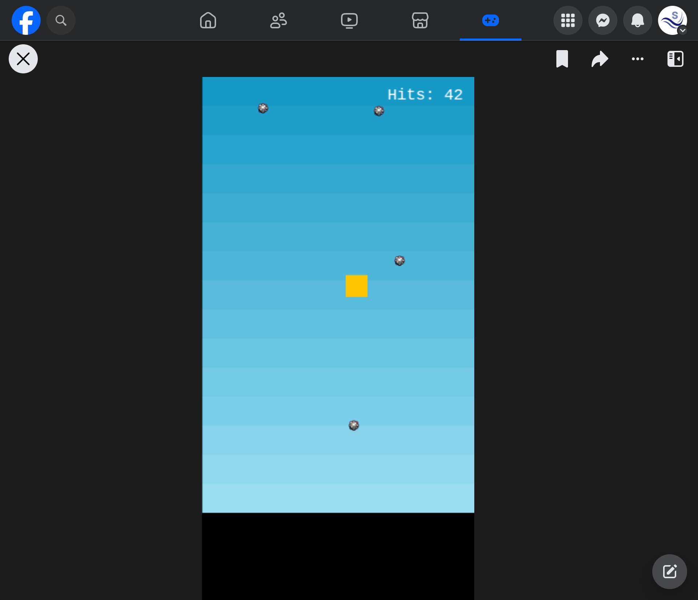

# phaser-facebook-instant-games-boilerplate
This is a boilerplate for creating Facebook Instant Games using PhaserJS.

## Local Development
To develop on local, create a .env in the root directory of your app and add the following:
```
VITE_ENVIRONMENT=sandbox
```

Using Terminal run the following commands:

`npm install`

`npm run dev`

## Deploying to Facebook Instant Games

To deploy to Facebook Instant Games, run `npm run build` and Vite will build the "dist" directory folder for you. Right click the directory and Zip it up (creating an archive file). Upload that archive file to Facebook Instant Games.



